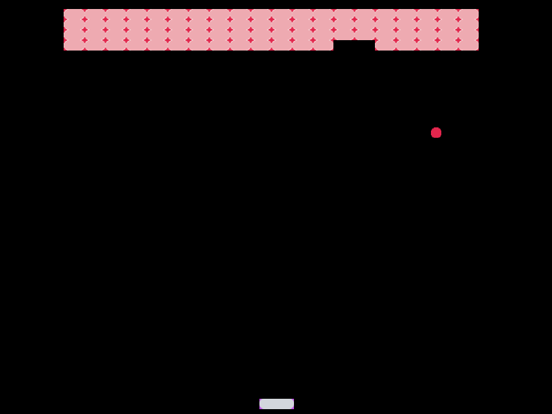

# Rust Breakout Clone

This is a learning project implementing Breakout in Rust. It uses
[luminance](https://github.com/phaazon/luminance-rs) for rendering and
[specs](https://github.com/amethyst/specs) to manage the game state.

## License

[MIT](./LICENSE)
